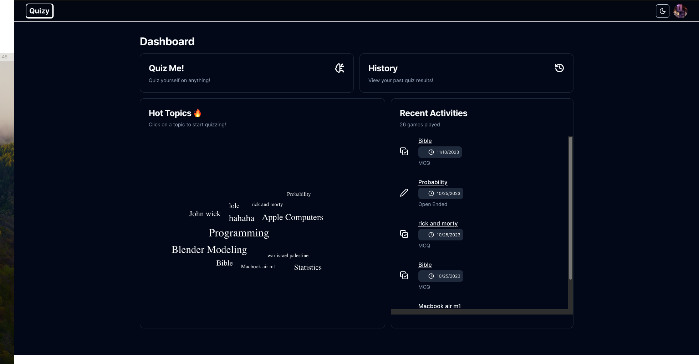
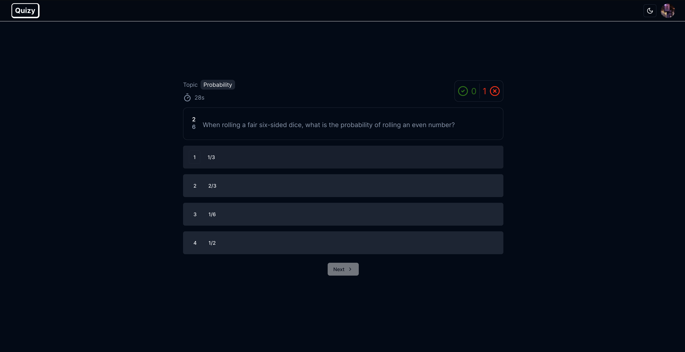
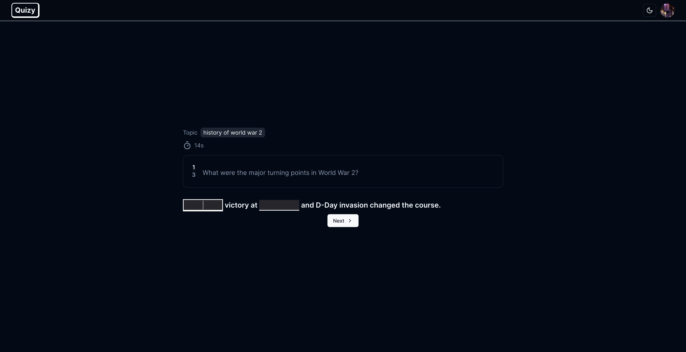

# NextQuiz - A Next.js Quiz App with ChatGPT Integration

## Introduction
NextQuiz is an interactive quiz application powered by Next.js and leverages the OpenAI ChatGPT API to generate engaging quizzes. It incorporates Google Authentication for a personalized user experience, making it easy to track progress and compete with friends.

## Features
- **Dynamic Quiz Generation**: Utilizes the ChatGPT API to create unique quiz questions on a wide range of topics.
- **Google Authentication**: Secure and convenient sign-in with a Google account.
- **User Progress Tracking**: Save and track your quiz performance and improvement over time.
- **Responsive Design**: A modern interface that adapts to mobile and desktop devices.
- **Social Sharing**: Share your quiz results with friends on social media platforms.

## Getting Started

First, run the development server:

```bash
npm run dev
# or
yarn dev
# or
pnpm dev
# or
bun dev
```

Open [http://localhost:3000](http://localhost:3000) with your browser to see the result.

You can start editing the page by modifying `app/page.tsx`. The page auto-updates as you edit the file.

### Prerequisites
- Node.js 14 or newer
- Next.js 10 or newer




